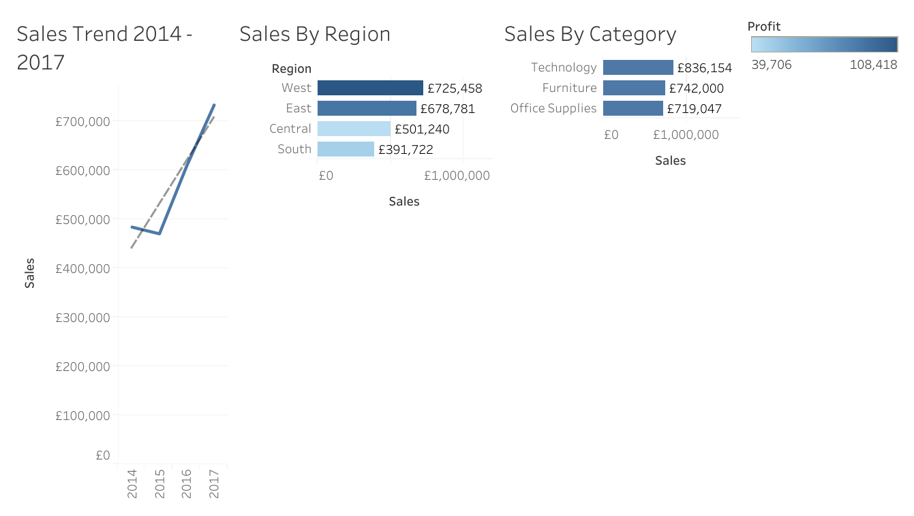

# Retail Sales Dashboard (Superstore Data)

This project is an interactive Tableau dashboard created using the Sample Superstore dataset.  
The goal was to analyse sales performance over time, across product categories, and by region.

🔗 [View Live Dashboard on Tableau Public](https://public.tableau.com/views/RetailSalesDashboardSuperstoreData/TotalSalesKPI)

---

## Key Insights
- 📈 Identified top-performing product categories and regional differences.
- 💰 Highlighted profit drivers and discount impacts.
- 🕒 Analysed sales trends across time and customer segments.

---

## Tools & Technologies
- **Tableau** → Dashboard creation & data visualisation  
- **Python (Pandas)**
